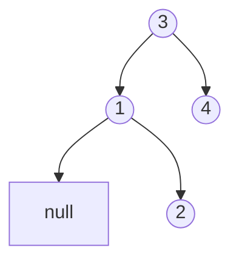
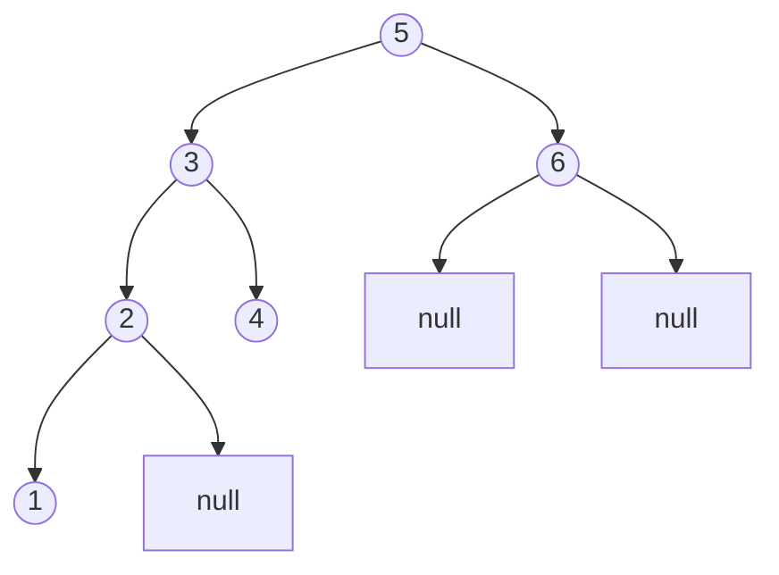

# K-ésimo Elemento Más Pequeño en un Árbol Binario de Búsqueda

## Descripción

Dado el `nodo raíz` de un árbol binario de búsqueda y un entero `k`, devuelve el *`k`-ésimo valor más pequeño* (****indexado desde 1****) de todos los valores de los nodos en el árbol.

**Ejemplo 1:**

En este árbol, el elemento más pequeño es 1. Como estamos buscando el primer elemento más pequeño (k = 1), la respuesta es 1.

**Ejemplo 2:**

Si ordenamos los elementos de este árbol de menor a mayor, obtenemos: 1, 2, 3, 4, 5, 6. El tercer elemento más pequeño (k = 3) es 3.
