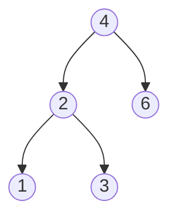
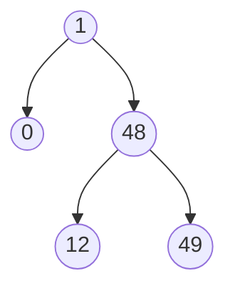

## Descripción

Dado el nodo raíz de un Árbol Binario de Búsqueda (BST), devuelve la diferencia absoluta mínima entre los valores de cualquier par de nodos diferentes en el árbol.

**Ejemplo 1:**

La diferencia mínima es 1

**Ejemplo 2:**

La diferencia mínima es 1