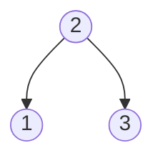
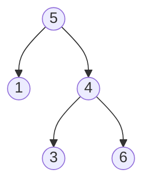

Siguiendo el formato solicitado, aquí está la adaptación del problema de LeetCode sobre la validación de un árbol binario de búsqueda:

## Árbol Binario de Búsqueda Válido

## Descripción

Dado el `root` de un árbol binario, *determina si es un árbol binario de búsqueda (BST) válido*.

Un **BST válido** se define de la siguiente manera:

* El subárbol izquierdo de un nodo contiene solo nodos con claves **menores que** la clave del nodo.
* El subárbol derecho de un nodo contiene solo nodos con claves **mayores que** la clave del nodo.
* Tanto el subárbol izquierdo como el derecho también deben ser árboles binarios de búsqueda.

## Ejemplos

**Ejemplo 1:**

Salida: true

Explicación: Este árbol es un BST válido. El nodo raíz tiene valor 2, su hijo izquierdo (1) es menor que 2, y su hijo derecho (3) es mayor que 2. No hay más subárboles que verificar, así que cumple todas las condiciones de un BST válido.

**Ejemplo 2:**

Salida: false

Explicación: Este árbol no es un BST válido. Aunque el nodo raíz (5) es mayor que su hijo izquierdo (1), lo cual es correcto, su subárbol derecho viola la regla. El nodo con valor 4 tiene un hijo derecho (6) que es mayor que 4, pero también es mayor que la raíz (5). En un BST válido, todos los nodos en el subárbol derecho deben ser mayores que la raíz, lo cual no se cumple aquí.
