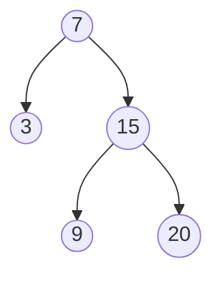

# Iterador de Árbol Binario de Búsqueda (BST)

Este problema consiste en implementar una clase `IteradorBST` que representa un iterador sobre el recorrido en orden de un árbol binario de búsqueda (BST, por sus siglas en inglés).

## Descripción del Problema

Implementa la clase `IteradorBST` con los siguientes métodos:

1. `IteradorBST(NodoArbol raiz)`: Inicializa un objeto de la clase `IteradorBST`. La `raiz` del BST se proporciona como parte del constructor. El puntero debe inicializarse a un número no existente menor que cualquier elemento en el BST.

2. `boolean tieneSiguiente()`: Devuelve `true` si existe un número en el recorrido a la derecha del puntero, de lo contrario devuelve `false`.

3. `int siguiente()`: Mueve el puntero a la derecha y luego devuelve el número en el puntero.

Nota: Al inicializar el puntero a un número no existente más pequeño, la primera llamada a `siguiente()` devolverá el elemento más pequeño del BST.

Puedes asumir que las llamadas a `siguiente()` siempre serán válidas. Es decir, habrá al menos un número siguiente en el recorrido en orden cuando se llame a `siguiente()`.

## Ejemplo

Considera el siguiente BST:



Así es como funcionaría el `IteradorBST` con este BST:

```
IteradorBST iteradorBST = new IteradorBST([7, 3, 15, null, null, 9, 20]);
iteradorBST.siguiente();    // devuelve 3
iteradorBST.siguiente();    // devuelve 7
iteradorBST.tieneSiguiente(); // devuelve True
iteradorBST.siguiente();    // devuelve 9
iteradorBST.tieneSiguiente(); // devuelve True
iteradorBST.siguiente();    // devuelve 15
iteradorBST.tieneSiguiente(); // devuelve True
iteradorBST.siguiente();    // devuelve 20
iteradorBST.tieneSiguiente(); // devuelve False
```

## Restricciones

- El número de nodos en el árbol está en el rango `[1, 10^5]`.
- `0 <= Valor del Nodo <= 10^6`
- Se realizarán como máximo `10^5` llamadas a `tieneSiguiente` y `siguiente`.

## Pregunta Adicional

¿Podrías implementar `siguiente()` y `tieneSiguiente()` para que se ejecuten en un tiempo promedio de `O(1)` y usen una memoria de `O(h)`, donde `h` es la altura del árbol?

## Enfoque de Solución

Un enfoque eficiente para resolver este problema es utilizar una pila para almacenar los nodos. Aquí tienes una visión general del algoritmo:

1. En el constructor, empuja todos los nodos más a la izquierda del árbol a la pila.
2. Para `siguiente()`, saca el nodo superior de la pila, empuja todos los nodos más a la izquierda de su subárbol derecho a la pila, y devuelve el valor del nodo sacado.
3. Para `tieneSiguiente()`, simplemente comprueba si la pila no está vacía.

Este enfoque asegura que mantengamos el orden del recorrido en orden mientras logramos una complejidad temporal promedio de `O(1)` para las operaciones `siguiente()` y `tieneSiguiente()`, y usamos una memoria de `O(h)`, donde `h` es la altura del árbol.