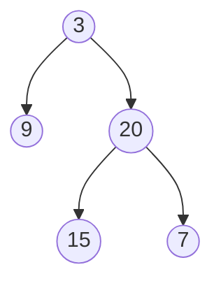

## Descripción

Dados dos arreglos de enteros `preorder` e `inorder`, donde `preorder` es el recorrido en preorden de un árbol binario e `inorder` es el recorrido en orden del mismo árbol, construye y devuelve el árbol binario.

Ejemplo de árbol binario:

Para este árbol:

- `preorder = [3,9,20,15,7]`
- `inorder = [9,3,15,20,7]`

## Solución

La solución a este problema se basa en las propiedades de los recorridos preorden e inorden:

- En el recorrido preorden, el primer elemento siempre es la raíz del árbol (o subárbol).

- En el recorrido inorden, los elementos a la izquierda de la raíz forman el subárbol izquierdo, y los elementos a la derecha forman el subárbol derecho.

Algoritmo:

1. Tomar el primer elemento de `preorder` como la raíz.

2. Encontrar la posición de la raíz en `inorder`.

3. Recursivamente construir el subárbol izquierdo con los elementos a la izquierda de la raíz en `inorder`.

4. Recursivamente construir el subárbol derecho con los elementos a la derecha de la raíz en `inorder`.

Esta implementación tiene una complejidad temporal de O(n^2) en el peor caso, donde n es el número de nodos. Sin embargo, se puede optimizar a O(n) utilizando un diccionario para almacenar los índices de los elementos en `inorder`.