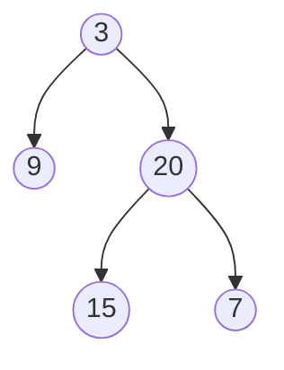
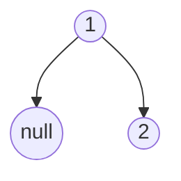

# Profundidad Máxima de un Árbol Binario

Dado el `raiz` de un árbol binario, devuelve *su profundidad máxima*.
La **profundidad máxima** de un árbol binario es el número de nodos a lo largo del camino más largo desde el nodo raíz hasta el nodo hoja más lejano.

## Ejemplo 1:



```
Entrada: raiz = [3,9,20,null,null,15,7]
Salida: 3
```

## Ejemplo 2:



```
Entrada: raiz = [1,null,2]
Salida: 2
```

## Restricciones:
* El número de nodos en el árbol está en el rango `[0, 10^4]`.
* `-100 <= Valor del Nodo <= 100`