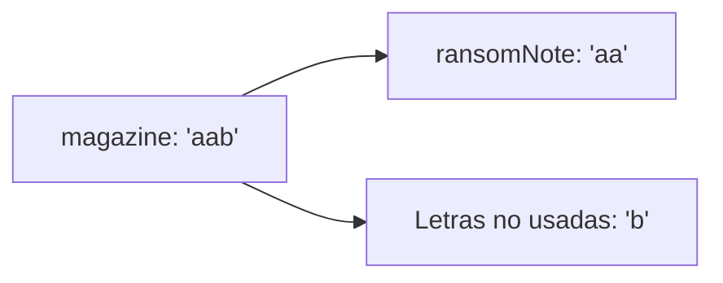

## Descripción

Dadas dos cadenas `ransomNote` y `magazine`, determina si es posible construir `ransomNote` utilizando las letras de `magazine`. Devuelve `true` si es posible, y `false` en caso contrario.

Cada letra en `magazine` solo puede ser utilizada una vez en `ransomNote`.

Ejemplos:

1. Entrada: ransomNote = "a", magazine = "b"
   Salida: false

2. Entrada: ransomNote = "aa", magazine = "ab"
   Salida: false

3. Entrada: ransomNote = "aa", magazine = "aab"
   Salida: true

## Solución

La solución más eficiente para este problema utiliza un enfoque de tabla hash (o array de conteo para este caso específico de letras minúsculas).

Algoritmo:

1. Crear un array de conteo para las 26 letras minúsculas del inglés.

2. Contar la frecuencia de cada letra en `magazine`.

3. Iterar sobre `ransomNote`, decrementando el conteo de cada letra.

4. Si en algún momento el conteo se vuelve negativo, retornar `false`.

5. Si se completa la iteración sin problemas, retornar `true`.

Esta algoritmo tiene una complejidad temporal de O(n + m), donde n es la longitud de `ransomNote` y m es la longitud de `magazine`.
