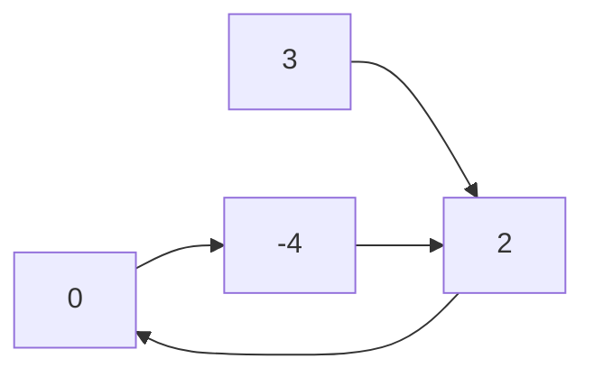
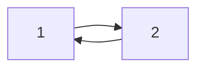
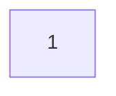

# Detectar Ciclo en una Lista Enlazada

## Descripción del Problema

Dado `head`, la cabeza de una lista enlazada, determina si la lista enlazada tiene un ciclo en ella.

Hay un ciclo en una lista enlazada si hay algún nodo en la lista que puede ser alcanzado nuevamente siguiendo continuamente el puntero next. Internamente, `pos` se usa para denotar el índice del nodo al que está conectado el puntero next del último nodo. Ten en cuenta que `pos` no se pasa como parámetro.

Devuelve `true` si hay un ciclo en la lista enlazada. De lo contrario, devuelve `false`.

## Ejemplos

### Ejemplo 1:

**Entrada:** head = [3,2,0,-4], pos = 1
**Salida:** true
**Explicación:** Hay un ciclo en la lista enlazada, donde la cola se conecta al primer nodo (índice 0).

### Ejemplo 2:

**Entrada:** head = [1,2], pos = 0
**Salida:** true
**Explicación:** Hay un ciclo en la lista enlazada, donde la cola se conecta al nodo 0.

### Ejemplo 3:

**Entrada:** head = [1], pos = -1
**Salida:** false
**Explicación:** No hay ciclo en la lista enlazada.

## Restricciones

- El número de nodos en la lista está en el rango [0, 10^4].
- -10^5 <= Node.val <= 10^5
- pos es -1 o un índice válido en la lista enlazada.

## Seguimiento

¿Puedes resolverlo usando O(1) (es decir, constante) memoria?